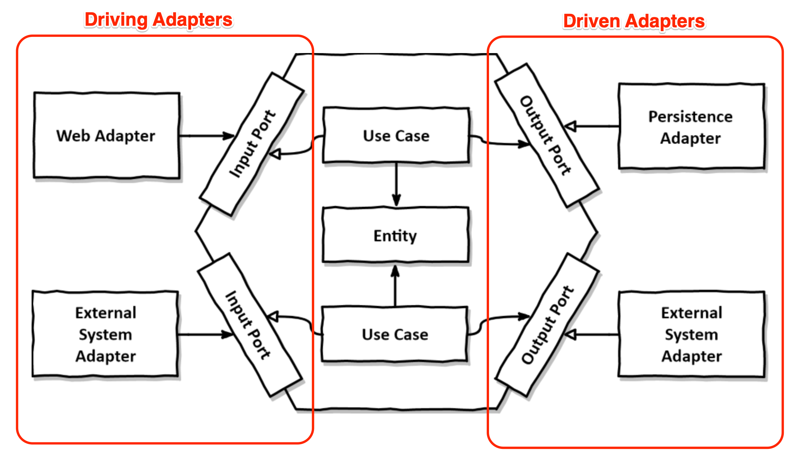

# DVx Base

A foundational project for any DVx technology-basex venture

## What is it?

A kotlin-based Spring Boot application using Reactive webflux APIs. 
The project uses a hexagonal architecture, along with 
[DDD](https://en.wikipedia.org/wiki/Domain-driven_design) 
principals to create a clean design that helps enforce good programming practice.

It is intended that any new DVx venture fork this GitHub repo and use this as the foundation
for a new application

## Why?

### Problems with traditional layered architectures

Typical Spring Boot applications use a layered architecture that looks something like this:

Spring Boot |
----------- |
Web |
Domain |
Persistence |

Nothing is inherently wrong with this, but a layered architecture has too many 
open flanks that allow bad habits to creep in and make the software increasingly 
harder to change over time.

* **It promotes DB-driven design**
    * By its very definition, the foundation of a conventional layered architecture is the database
    * This creates a strong coupling between the persistence layer and the domain layer.
    * The persistence code is virtually fused into the domain code and thus it’s hard to change 
      one without the other. That’s the opposite of being flexible and keeping options open.
* **It's prone to shortcuts**
    * The only global rule is that from a certain layer, we can only access components in the same layer or a layer below
    * if we need access to a certain component in a layer above ours, we can just push the component down a layer and we’re allowed to access it. 
      Problem solved? Over time, the persistence layer will grow fat as we push components down through the layers.
* **It grows hard to test**
    * A common evolution within a layered architecture is that layers are being skipped. We access the persistence layer directly from the web layer.
    * We’re implementing domain logic in the web layer, even if it’s only manipulating a single field. What if the use case expands in the future?
    * In the tests of our web layer, we not only have to mock away the domain layer, but also the persistence layer.
* **It hides the use cases**
    * In a layered architecture it easily happens that domain logic is scattered throughout the layers
    * A layered architecture does not impose rules on the “width” of domain services. Over time, this often leads to very broad services that serve multiple use cases
    * A broad service has many dependencies to the persistence layer and many components in the web layer depend on it.
* **It makes parallel work difficult**
    * Working on different use cases will cause the same service to be edited in parallel which leads to merge conflicts and potentially regressions.
    

### Hexagonal Architecture to the rescue



* This project was inspired by: https://reflectoring.io/spring-hexagonal/
* Lots more about hexagonal architecture: https://blog.octo.com/en/hexagonal-architecture-three-principles-and-an-implementation-example/


### `dvx-base` bounded context layout

```yml
user: Name of your bounded context (in this case, "user")
  domain: The core. Depends on nothing. All Business Logic. Built using ADTs
  adapter: Adapters connect to outside systems
    in: Input adapters "drive" the system, causing the system to act
      web: Typically Spring Controllers 
    out: Output adapters are "driven" by the system
      persistence: Typically DB Entity classes and DAOs (e.g. Spring Repositories)
  application: Comprised of Ports and Use Cases, these define the interface to our app.
    workflows: Workflows with defined input/output types
    port: Allows communication between the app core and the adapters
      in: Use Case interfaces that define API and types for "driving" operations
      out: Typically interfaces called by the core for "driven" operations
```

### How does this layout help build maintainable software?

Name it Clean Architecture, Hexagonal Architecture or Ports and Adapters Architecture - 
by inverting our dependencies so that the domain code has no dependencies to the outside 
we can decouple our domain logic from all those persistence and UI specific problems 
and reduce the number of reasons to change throughout the codebase. And fewer reasons 
to change means better maintainability.

The domain code is free to be modelled as best fits the business problems while 
the persistence and UI code are free to be modelled as best fits the persistence 
and UI problems.

## Guidelines on how to use this project

The architecture closely follows a template outlined in 
[Get Your Hands Dirty on Clean Architecture](https://leanpub.com/get-your-hands-dirty-on-clean-architecture) 
with some notable changes, outlined here

1. **Create a new maven module for any new bounded context**
   
    Out of the box, a `User` bounded context is created for you that includes basic registration 
    and login capability. This module also forms a pattern for any new bounded context.
   
2. **Never throw exceptions in Business Logic**

    This architecture takes a page out of the functional programming playbook. 
    In FP, typically a function takes an input, and returns the same output for any given input. 
    Functions never throw exceptions, but rather return a type that captures either the desired
    value OR the Error (e.g. with an `arrow.core.Either`). 
    In this architecture, an attempt is made to embody this practice at all layers of the application.
    More on this later.
   
3. **The Domain should be built using Algebraic Data Types**

    More on this below, but for now read these very carefully:

    1. See: https://www.47deg.com/blog/functional-domain-modeling/
    2. See: https://www.47deg.com/blog/functional-domain-modeling-part-2/
    3. See: https://medium.com/rocket-fuel/kotlin-by-class-delegation-favor-composition-over-inheritance-a1b97fecd839
    
4. **Enforce Architecture with ArchUnit**

    This project enforces that the structure of each bounded context strictly enforces the purity
    of the hexagonal architecture through the use of ArchUnit testing. Specifically, it ensures
    that classes cannot import classes from other packages that it **should NOT** have access to.
    
## Algebraic Data Types in `dvx-base`

TODO

## CQRS 

This project has some light tooling to support CQRS through the use
of a RequestDispatcher where each request is either a Command or Query.

It was inspired by: https://medium.com/swlh/cqrs-and-application-pipelines-in-kotlin-441d8f7fe427
